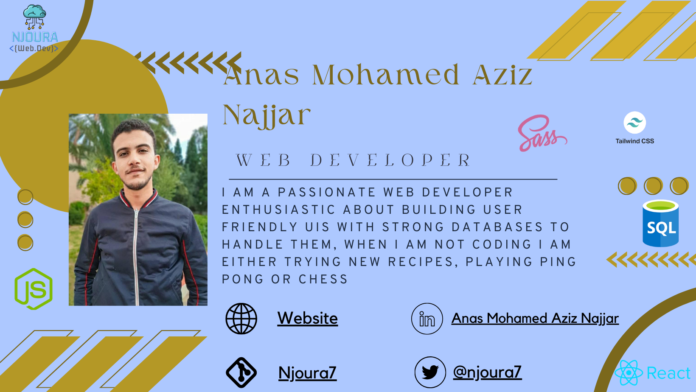

# Hello_world
### Hey <Aziz/> here 👋

---

## I am a {software engineer} and a < Web developer />, passionate about creating friendly UI for users using the latest technologies and building strong databases that handle their needs, I am also enthusiastic about web animations since I believe that it's the future of the web!! . :wink:
 
 🔭 I’m planning for a Project **pingMeetPong**(platform that allows ping pong players to meet up).

 
 :books: I am currently learning  and 
 
 👯 I’m looking for web development internships or part-time jobs.
 
---

### You can find in me in the web 🌍
[][website]

[][twitter]
[][linkedin]

 
<!-- Links: -->

---

  

---

### Tech & Tools Preference

          
 

  
 

### Other Languages I know
 	  

---

---

---
### You can checkout my blogs :loudspeaker: 

---

[website]: https://github.com/Njoura7
[twitter]: https://twitter.com/Njoura7
[instagram]: https://www.instagram.com/web.dev_njoura/
[linkedin]:https://www.linkedin.com/in/anas-mohamed-aziz-najjar-400672200/

